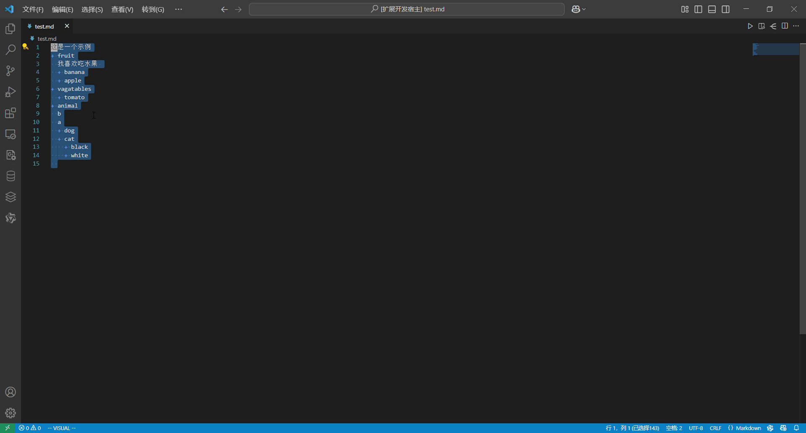

# markdown-sort README

**markdown list 排序功能，可在VScode插件中下载**。

## 功能

这是一个示例：

> Tip: 支持选中markdown列表的分级排序。对非列表内容保持原顺序和位置。

## 如何使用

例：

+ 选中需要排序的列表，命令行中输入`Sort Markdown List`
+ 选中需要排序的列表，右键`Sort Markdown List`

## 问题

如果有bug，请发送如下邮件1205620322@qq.com

## 版本

### 1.0.0

+ 仅支持列表排序

## 更多信息

* [Visual Studio Code's Markdown Support](http://code.visualstudio.com/docs/languages/markdown)
* [Markdown Syntax Reference](https://help.github.com/articles/markdown-basics/)

**启动!**
